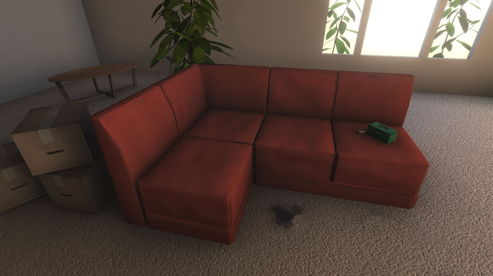

<h1>

So Far From Home
</h1>

 \

Searching between the sofa cushions for a missing key, but what else is down there? Every item to you find tells a little piece of the story of your life and friendships.

**Global Game Jam 2019**\
**Theme**: "Home"

## Credits

**[Paul Hayes](https://github.com/paulhayes):** Code and Game Development\
**[Evan Griffiths](https://github.com/Blooker):** Code and UI\
**[Amy Godliman](https://github.com/ACGodliman):** Writing, art direction, and additional art assets\
**[Aoife Balfe](https://github.com/CrowGyrl):** Music and Sound Design\
**[Fydar](https://github.com/Fydar):** Code and UI\
**[Denis Gruba](https://globalgamejam.org/users/denisgruba)** 3d Asset Creation
